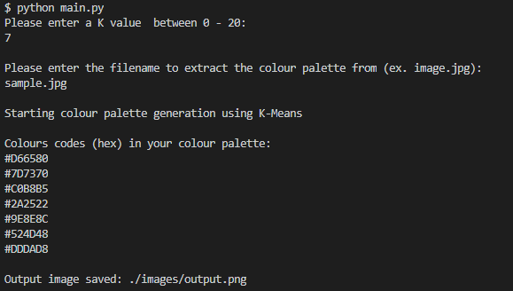

# K-Means Colour Palette Generator
## Algorithm Overview
This is an implementation of the K-means clustering algorithm which will extract the *K* most dominant colours from any given image. I've summarized how this algorithm works below.
1. Randomly select K points (colours)
2. Assign each pixel in the image to the closest cluster (K point)
3. Compute and place the new centroid of each cluster
4. Repeat as necessary until minimal reassignment occurs, in which case the model is ready

## Execution
Download the repository, install the dependencies via pip, then from the terminal run: `python main.py`. 

*Requires Python 3.8 or higher.*

Upon execution, you will be prompted for 2 values:
1. *k value*: which is # of colours to extract from the image
2. *image filename*: must include file extension and file must be in *images/* directory

### Sample Execution

## Dataset
The following sample image has been uploaded alongside the code.

## Results
The resulting image is saved as *./images/output.png*. Below are sample results for the sample image/execution.

 

## Reference Materials
1. [Dominant Colours in an Image using K-Means Clustering](https://buzzrobot.com/dominant-colors-in-an-image-using-k-means-clustering-3c7af4622036)